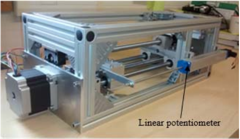
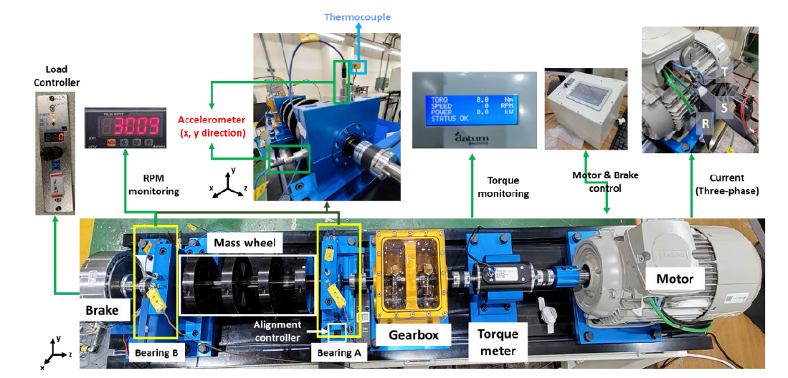
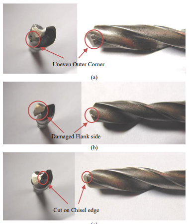
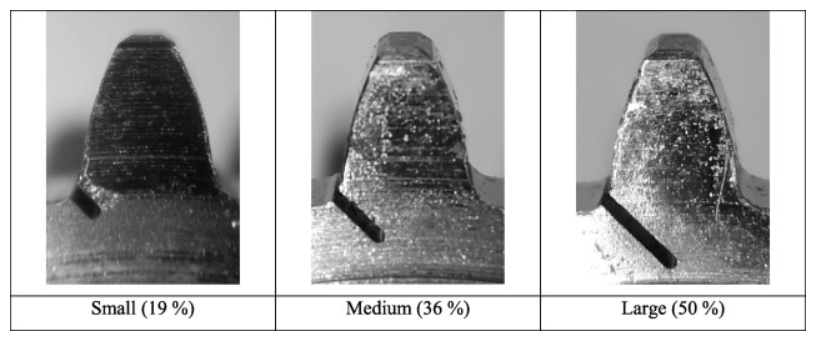

---
# doge-data

A collection of **do**main **ge**neralization **data**sets. 

We are interested in fault datasets but other kinds of datasets or contributions
are welcome. If you have any datasets suitable for domain generalization and want to contribute,
please send in a pull request. Thanks.

---

## Table of Contents

<!--

Generated with [markedpp](#markedpp). Get [nodejs](https://nodejs.org) first

1. $ npm i -g markedpp
2. $ markedpp --github -o README.md README.md

-->

<!-- !toc (minlevel=2 omit="Table of Contents") -->

* [Fault Datasets](#fault-datasets)
  * [Actuator](#actuator)
    * [CU](#cu)
  * [Bearing](#bearing)
    * [JUST](#just)
    * [DLR](#dlr)
    * [KAIST](#kaist)
    * [CWRU](#cwru)
    * [MFPT](#mfpt)
    * [PU](#pu)
    * [JNU](#jnu)
  * [Drill](#drill)
    * [IITK](#iitk)
  * [Gear](#gear)
    * [MCC5-THU](#mcc5-thu)
    * [UNSW](#unsw)
  * [Motor](#motor)
    * [BNUT](#bnut)
    * [MUET](#muet)
  * [Pump](#pump)
    * [RNN](#rnn)
  * [Sensor](#sensor)
  * [Wind Turbine](#wind-turbine)
* [Interesting Data](#interesting-data)
* [Relevant Links](#relevant-links)
  * [Popular Data Repositories](#popular-data-repositories)

<!-- toc! -->

---

## Fault Datasets
Datasets with multiple working conditions for condition monitoring and fault diagnosis 

### Actuator

#### CU
- [Data Link](https://cord.cranfield.ac.uk/articles/dataset/Data_set_for_Data-based_Detection_and_Diagnosis_of_Faults_in_Linear_Actuators_/5097649)
- [Paper](https://ieeexplore.ieee.org/document/8326716)
- 

  
More detail

  > **Through-life Engineering Services Institute, Cranfield University**
  > 
  >The data was acquired from a linear actuator rig operated using different loading
  > conditions and motion profiles. In addition, three different faults (lack of 
  > lubrication, spalling and backlash) were gradually seeded to the system in order
  > to study fault detection and diagnosis capabilities of different algorithms. The
  > data set includes actuator position and motor current measurements for the different
  > conditions mentioned.
  > 
  >

### Bearing

#### JUST
- [Data Link](https://data.mendeley.com/datasets/hwg8v5j8t6/1)
- 

  
More detail

  The fault test data set contains the vibration signal and sound emission 
  signal of the slewing support under 9 working conditions, and clearly 
  marks the collection time, fault label, speed, load, collection times 
  and other relevant information of the slewing support. Among them, each
  csv file contains a total of 7 columns of data, the first, fourth, 
  fifth and sixth are listed as vertical vibration signals, the second 
  and third are listed as horizontal vibration signals, and the seventh 
  is listed as acoustic emission signals. Each csv file is named 
  successively according to "collection time - fault type - speed 
  - overturning force - sampling times of each working condition", 
  for example, "20221208-N-2rpm-0N-1",... "20221208-N-2rpm-0N-5", 
  where the sampling times of the slewing-bearing in different states 
  under each working condition are 5 times. The data set consists of
  one healthy slewing support and three slewing supports in single 
  failure mode. Among them, the "healthy slewing support" is marked 
  as "N", the "inner ring failure slewing support" is marked as "I", 
  the "outer ring failure slewing support" is marked as "O", and the 
  "one rolling body failure slewing support" is marked as "B1".

#### DLR
- [Data Link](https://data.mendeley.com/datasets/chwhh9n3bf/2)

- 

  
More detail

  Institutions: Deutsches Zentrum fur Luft und Raumfahrt Standort Braunschweig, Tekniker
  
  The datasets involve vibration measurements for axial ball bearings in healthy 
  and faulty conditions. The faulty conditions are for artificially-seeded spall
  defects at the outer and the inner races. There are 28 datasets in two groups.
  The first group is for a fault-free condition and it consists of four datasets.
  The second group involves 24 datasets for six levels of fault-sizes and four 
  loading groups. The file is a standard MATLAB data file ".mat". The file name
  for each dataset follows the following format: (NX_R_S_T.mat), where X indicates
  the applied axial load in kN, R is the spindle speed in revolutions per minute,
  S is the spall fault width in millimeters and T is the spall location on 
  the outer or the inner races. Each dataset has a single time series for the
  axial vibration from an accelerometer mounted on the bearing outer race 
  (radial axis).  Both of the spindle speed and the axial load are time invariant 
  within the dataset. All datasets are sampled at 25.6 kHz for a duration of 30 
  seconds.

#### KAIST
- [Data Link 1 for bearing (different loads) ](https://data.mendeley.com/datasets/ztmf3m7h5x)
- - [Data Link 2 for bearing (different speeds Part 1) ](https://data.mendeley.com/datasets/vxkj334rzv)
- - [Data Link 2 for bearing (different speeds Part 2) ](https://data.mendeley.com/datasets/x3vhp8t6hg)
- [Data Link 2 for bearing (different speeds Part 3) ](https://data.mendeley.com/datasets/j8d8pfkvj2)
- [Data Link 3 for motor stator faults](https://data.mendeley.com/datasets/rgn5brrgrn)
- 

  
More detail

  > **Korea Advanced Institute of Science and Technology**
  > 
  > 1 This article presents time-series dataset including vibration, acoustic,
  > temperature, and motor current data for rotating machines under varying
  > load conditions.  The conditions of the rotating machine include normal,
  > bearing inner race faults, bearing outer race faults, shaft misalignment,
  > and rotor unbalance with three different load conditions. 
  > 
  > 2 This article discloses vibration and motor current data for bearing faults under
  > varying speed conditions from 680 RPM to 2460 RPM. The bearing conditions include 
  > healthy bearing, bearings with inner race faults, and bearings with outer race faults.
  > For each faulty bearing condition, the three-phase induction motor is operated under 
  > randomly varying speed conditions. 
  > 
  > 3 This dataset provides vibration and motor current data for fault diagnosis of motor winding faults. 
  > Vibration data is acquired with a sampling frequency of 25.6 kHz, and current data is acquired with 
  > a sampling frequency of 100 kHz. In order to acquire the data, a testbed with motor winding faults 
  > was used.
  > 
  > 

#### CWRU 
- [Data Link](https://engineering.case.edu/bearingdatacenter)
- 

  
More detail

  > **Case Western Reserve University**
  > 
  > Motor bearings were seeded with faults using electro-discharge machining
  > (EDM). Faults ranging from 0.007 inches in diameter to 0.040 inches in 
  > diameter were introduced separately at the inner raceway, rolling element 
  > (i.e. ball) and outer raceway. Faulted bearings were reinstalled into the
  > test motor and vibration data was recorded for motor loads of 0 to 3 
  > horsepower (motor speeds of 1797 to 1720 RPM).
  > 
  >
  >
  > 
  > [image source](https://www.sciencedirect.com/science/article/pii/S0019057820303335)

#### MFPT
- [Data Link](https://www.mfpt.org/fault-data-sets/#:~:text=A%20bearing%20fault%20dataset%20has,and%20three%20real%2Dworld%20faults.)
- 

  
More detail

  > **Mechanical Failures Prevention Group**
  > 
  > -3 baseline conditions: 270 lbs of load, input shaft rate of 25 Hz, sample rate of
  > 97,656 sps, for 6 seconds  
  >-3 outer race fault conditions: 270 lbs of load, input shaft rate of 25 Hz, sample 
  > rate of 97,656 sps for 6 seconds  
  >-7 outer race fault conditions: 25, 50, 100, 150, 200, 250 and 300 lbs of load,
  > input shaft rate 25 Hz, sample rate of 48,828 sps for 3 seconds (bearing 
  > resonance was found be less than 20 kHz)  
  >7 inner race fault conditions: 0, 50, 100, 150, 200, 250 and 300 lbs of load, 
  > input shaft rate of 25 Hz, sample rate of 48,828 sps for 3 seconds
  > 
  >
  >
  > 
  > [table source](https://www.sciencedirect.com/science/article/pii/S0019057820303335)

#### PU
- [Data Link](https://mb.uni-paderborn.de/kat/forschung/datacenter/bearing-datacenter)
- 

  
More detail

  >Bearings were divided into: (1) six undamaged bearings; (2) twelve artificially 
  > damaged bearings; (3) fourteen bearings with real damages caused by accelerated
  > lifetime tests. Each dataset was collected under four working conditions
  > 
  >
  > 
  > 
  > [table source](https://www.sciencedirect.com/science/article/pii/S0019057820303335)

#### JNU
- [Data Link](http://mad-net.org:8765/explore.html?t=0.5831516555847212)
- 

  
More detail

  > **School of Mechanical Engineering, Jiangnan University**
  > 
  >JNU datasets consisted of three bearing vibration datasets with different rotating
  > speeds, and the data were collected at 50 kHz. JNU datasets contained one health 
  > state and three fault modes which include inner ring fault, outer ring fault, and
  > rolling element fault.
  >
  >
  > 
  > [table source](https://www.sciencedirect.com/science/article/pii/S0019057820303335)

### Motor

#### BNUT
- [Data Link](https://data.mendeley.com/datasets/m4sbt8hbvk/3)  
- 

  
More detail

  This is a thermal image dataset specifically focused on condition monitoring 
  of electrical equipment, specifically induction motors. The dataset includes
  artificially generated internal faults, such as short circuit failures in 
  the stator windings, stuck rotor faults, and cooling fan failures. The 
  thermal images were acquired using a Dali-tech T4/T8 infrared thermal image
  camera in an Electrical Machines Laboratory, with an ambient temperature of
  23°. 

#### MUET
- [Data Link](https://data.mendeley.com/datasets/fm6xzxnf36/2)  
- [Paper](https://www.ncbi.nlm.nih.gov/pmc/articles/PMC9156863/)
- 

  
More detail

  > **NCRA Condition Monitoring Systems Lab, 
  > Mehran University of Engineering and Technology***
  >
  >The dataset includes triaxial vibration data of bearing of induction motor operated 
  > under different load conditions along the axes x, y, and z. It includes triaxial 
  > vibration datasets of motor in healthy condition with and without pulley. Moreover,
  > the faulty conditions of bearings include inner race and outer race faults of (i)
  > 0.7mm, (i) 0.9mm, (i) 1.1mm, (i) 1.3mm, (i) 1.5m, and (i) 1.7mm. The bearings with
  > these fault severity levels were operated under different load conditions including 
  > 100W, 200W, and 300W. There are total 38 datasets of the bearing conditions. The 
  > data was acquired at the sampling rate of 10 kHz at the rate of 1000 samples per
  > channel.
  > 
  > 

### Drill
#### IITK
- [Data Link](https://www.iitk.ac.in/idea/datasets/)
- [Paper](https://rs.ieee.org/images/files/newsletters/2015/_12_Data_Driven_Aproach_for_Drill_Bit_Monitoring_Modified_20150323.doc.pdf)
- 

  
More detail

  >Department of Electrical Engineering,
  Indian Institute of Technology Kanpur
  > 
  >The entire experimentation was performed with 3-AxisCNC EMCO Concept Mill 105. 
  > HSS twist drill bit of diameter 9 mm was used for drilling holes in the work 
  > piece made of Mild steel. For extensive experimentation, given a drill bit state
  > , for each pair of varying feed rates and cutting speed combinations, a single 
  > vibration recording of 8 seconds was taken. Feed rate was varied as 4 mm/min,
  > 8 mm/min and 12 mm/min, and Cutting speed was varied as 160rpm, 170rpm, 180rpm,
  > 190rpm and 200rpm; giving a total of 15 combination pairs.
  > 
  > 

### Gear

#### MCC5-THU
- [Data Link](https://data.mendeley.com/datasets/p92gj2732w/2)
- [Paper](https://arxiv.org/abs/2403.12521)
- 

  
More detail

  The gearbox is a critical component of electromechanical systems. 
  The occurrence of multiple faults can significantly impact system 
  accuracy and service life. The vibration signal of the gearbox is
  an effective indicator of its operational status and fault information. 
  However, gearboxes in real industrial settings often operate under 
  variable working conditions, such as varying speeds and loads. It is
  a significant and challenging research area to complete the gearbox
  fault diagnosis procedure under varying operating conditions using 
  vibration signals. This data article presents vibration datasets
  collected from a gearbox exhibiting various fault degrees of severity 
  and fault types, operating under diverse speed and load conditions. 
  These faults are manually implanted into the gears or bearings through
  precise machining processes, which include health, missing teeth, wear,
  pitting, root cracks, and broken teeth. Several kinds of actual compound
  faults are also encompassed. The development of these datasets 
  facilitates testing the effectiveness and reliability of newly 
  developed fault diagnosis methods.

#### UNSW
- [Data Link](https://data.mendeley.com/datasets/p72x3m92cv)
- [Paper](https://doi.org/10.1016/j.ymssp.2022.108957)
- 

  
More detail

  >Tribology and Machine Condition Monitoring (TMCM) group at the 
  > University of New South Wales
  > 
  > A series of tests were conducted at different operating loads
  > and speeds, with pinion cracks of three different sizes (small, 
  > medium and large). 
  > 
  > A total of 90 test files are available, corresponding to all the 
  > combinations of the following:
  > 
  > - Crack severity: Healthy (H), Small crack (S), Medium crack (M), 
  > Large crack (L)
  > 
  > - Speed: 2, 5, 10, 15, 20 Hz (nominal values)
  > 
  > - Torque: 0, 5, 10, 15, 20 Nm (nominal values)
  > 

### Pump
#### RNN
- [Data Link](https://www.data-in-brief.com/article/S2352-3409(23)01017-X/fulltext)

### Sensor

### Wind Turbine

## Interesting Data
Interesting data even though may not suit domain generalization 
### Railway Track Surface Faults Dataset
- [Data Link](https://data.mendeley.com/datasets/8hxtgyyxrw/2)
### Autonomous Underwater Vehicle Fault Diagnosis Dataset
- [Data Link](https://data.mendeley.com/datasets/7rp2pmr6mx)

### Relevant Links
#### Popular Data Repositories
- [Google Dataset Search](https://datasetsearch.research.google.com/)
- [Data in Brief](https://www.data-in-brief.com/)
- [Zenodo](https://zenodo.org/)
- [Data-World](https://data.world/)
- [Mendeley Data](https://data.mendeley.com/)
- [figshare](http://figshare.com/)
- [Zenodo](https://zenodo.org/)
- [UCI Machine Learning Repository](https://archive.ics.uci.edu/ml/index.php)
- [Harvard Dataverse](http://dataverse.harvard.edu/)
- [Dryad Digital Repository](http://datadryad.org/)
- [Github](https://github.com/)
- [Kaggle](https://www.kaggle.com/)