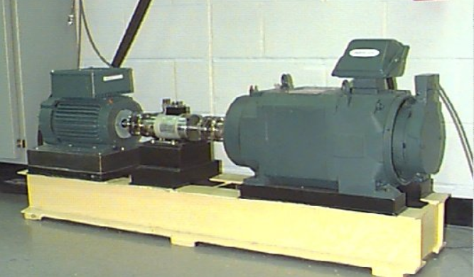
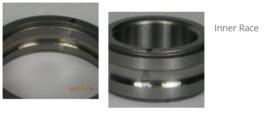
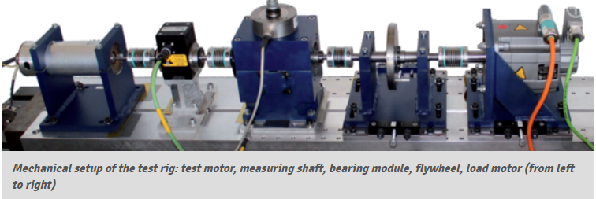
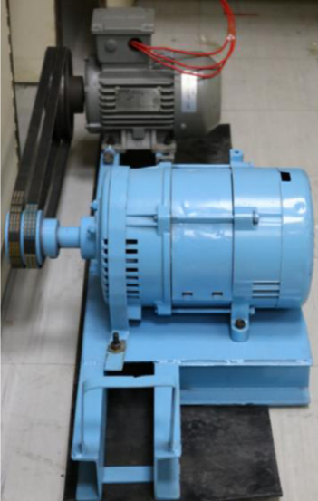

---
# doge-data

A collection of **do**main **ge**neralization **data**sets. 

Contributions are welcome. Any datasets? Send in a pull request. Thanks.

---

## Table of Contents

<!--

Generated with [markedpp](#markedpp). Get [nodejs](https://nodejs.org) first

1. $ npm i -g markedpp
2. $ markedpp --github -o README.md README.md

-->

<!-- !toc (minlevel=2 omit="Table of Contents") -->

* [Fault Datasets](#fault-datasets)
  * [Actuator](#actuator)
    * [CU](#cu)
  * [Bearing](#bearing)
    * [CWRU](#cwru)
    * [MFPT](#mfpt)
    * [PU](#pu)
    * [JNU](#jnu)
  * [Motor](#motor)
    * [MUET](#muet)
  * [Gear](#gear)
  * [Sensor](#sensor)
  * [Wind Turbine](#wind-turbine)

<!-- toc! -->

---

## Fault Datasets
Datasets for condition monitoring and fault diagnosis

### Actuator

#### CU
- [Data Link](https://cord.cranfield.ac.uk/articles/dataset/Data_set_for_Data-based_Detection_and_Diagnosis_of_Faults_in_Linear_Actuators_/5097649)
- [Paper](https://ieeexplore.ieee.org/document/8326716)
> **Through-life Engineering Services Institute, Cranfield University**
> 
>The data was acquired from a linear actuator rig operated using different loading
> conditions and motion profiles. In addition, three different faults (lack of 
> lubrication, spalling and backlash) were gradually seeded to the system in order
> to study fault detection and diagnosis capabilities of different algorithms. The
> data set includes actuator position and motor current measurements for the different
> conditions mentioned.
> 
> 

### Bearing
#### CWRU 
- [Data Link](https://engineering.case.edu/bearingdatacenter)
> **Case Western Reserve University**
> 
> Motor bearings were seeded with faults using electro-discharge machining
> (EDM). Faults ranging from 0.007 inches in diameter to 0.040 inches in 
> diameter were introduced separately at the inner raceway, rolling element 
> (i.e. ball) and outer raceway. Faulted bearings were reinstalled into the
> test motor and vibration data was recorded for motor loads of 0 to 3 
> horsepower (motor speeds of 1797 to 1720 RPM).
> 
> 
>
> 
> [image source](https://www.sciencedirect.com/science/article/pii/S0019057820303335)

#### MFPT
- [Data Link](https://www.mfpt.org/fault-data-sets/#:~:text=A%20bearing%20fault%20dataset%20has,and%20three%20real%2Dworld%20faults.)
> **Mechanical Failures Prevention Group**
> 
> -3 baseline conditions: 270 lbs of load, input shaft rate of 25 Hz, sample rate of
> 97,656 sps, for 6 seconds  
>-3 outer race fault conditions: 270 lbs of load, input shaft rate of 25 Hz, sample 
> rate of 97,656 sps for 6 seconds  
>-7 outer race fault conditions: 25, 50, 100, 150, 200, 250 and 300 lbs of load,
> input shaft rate 25 Hz, sample rate of 48,828 sps for 3 seconds (bearing 
> resonance was found be less than 20 kHz)  
>7 inner race fault conditions: 0, 50, 100, 150, 200, 250 and 300 lbs of load, 
> input shaft rate of 25 Hz, sample rate of 48,828 sps for 3 seconds
> 
> > 
>
> 
> [table source](https://www.sciencedirect.com/science/article/pii/S0019057820303335)

#### PU
- [Data Link](https://mb.uni-paderborn.de/kat/forschung/datacenter/bearing-datacenter)
>Bearings were divided into: (1) six undamaged bearings; (2) twelve artificially 
> damaged bearings; (3) fourteen bearings with real damages caused by accelerated
> lifetime tests. Each dataset was collected under four working conditions
> 
>
> 
> 
> [table source](https://www.sciencedirect.com/science/article/pii/S0019057820303335)

#### JNU
- [Data Link](http://mad-net.org:8765/explore.html?t=0.5831516555847212)
> **School of Mechanical Engineering, Jiangnan University**
> 
>JNU datasets consisted of three bearing vibration datasets with different rotating
> speeds, and the data were collected at 50 kHz. JNU datasets contained one health 
> state and three fault modes which include inner ring fault, outer ring fault, and
> rolling element fault.
>
>
> 
> [table source](https://www.sciencedirect.com/science/article/pii/S0019057820303335)

### Motor
#### MUET
- [Data Link](https://data.mendeley.com/datasets/fm6xzxnf36/2)  
- [Paper](https://www.ncbi.nlm.nih.gov/pmc/articles/PMC9156863/)
> **NCRA Condition Monitoring Systems Lab, 
> Mehran University of Engineering and Technology***
>
>The dataset includes triaxial vibration data of bearing of induction motor operated 
> under different load conditions along the axes x, y, and z. It includes triaxial 
> vibration datasets of motor in healthy condition with and without pulley. Moreover,
> the faulty conditions of bearings include inner race and outer race faults of (i)
> 0.7mm, (i) 0.9mm, (i) 1.1mm, (i) 1.3mm, (i) 1.5m, and (i) 1.7mm. The bearings with
> these fault severity levels were operated under different load conditions including 
> 100W, 200W, and 300W. There are total 38 datasets of the bearing conditions. The 
> data was acquired at the sampling rate of 10 kHz at the rate of 1000 samples per
> channel.
> 
> 

### Drill Bit
#### IITK
- [Data Link](https://www.iitk.ac.in/idea/datasets/)
- [Paper](https://rs.ieee.org/images/files/newsletters/2015/_12_Data_Driven_Aproach_for_Drill_Bit_Monitoring_Modified_20150323.doc.pdf)
>Department of Electrical Engineering,
Indian Institute of Technology Kanpur
>The entire experimentation was performed with 3-AxisCNC EMCO Concept Mill 105. 
> HSS twist drill bit of diameter 9 mm was used for drilling holes in the work 
> piece made of Mild steel. For extensive experimentation, given a drill bit state
> , for each pair of varying feed rates and cutting speed combinations, a single 
> vibration recording of 8 seconds was taken. Feed rate was varied as 4 mm/min,
> 8 mm/min and 12 mm/min, and Cutting speed was varied as 160rpm, 170rpm, 180rpm,
> 190rpm and 200rpm; giving a total of 15 combination pairs.
> 
> 

### Gear

### Sensor

### Wind Turbine
