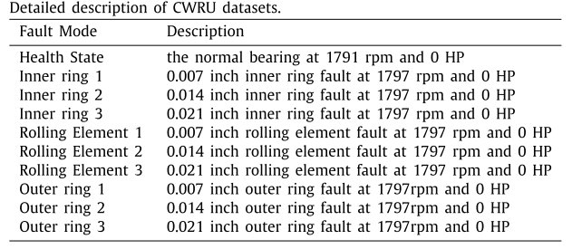
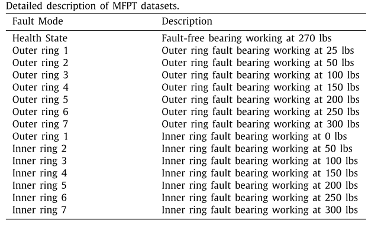
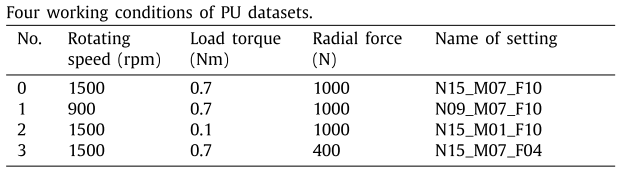
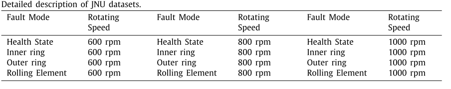

---
# doge-data

A collection of **do**main **ge**neralization **data**sets. 

Contributions are welcome. Any datasets? Send in a pull request. Thanks.

---

## Table of Contents

<!--

Generated with [markedpp](#markedpp). Get [nodejs](https://nodejs.org) first

1. $ npm i -g markedpp
2. $ markedpp --github -o README.md README.md

-->

<!-- !toc (minlevel=2 omit="Table of Contents") -->

* [Fault Datasets](#fault-datasets)
  * [Actuator](#actuator)
  * [Bearing](#bearing)
  * [Motor](#motor)
  * [Bearing](#gear)
  * [Sensor](#sensor)
  * [Wind Turbine](#wind-turbine)

<!-- toc! -->

---

## Fault Datasets
Datasets for condition monitoring and fault diagnosis
### Actuator
- [Linear Actuators ](https://cord.cranfield.ac.uk/articles/dataset/Data_set_for_Data-based_Detection_and_Diagnosis_of_Faults_in_Linear_Actuators_/5097649)
 , paper @ [Cristobal Ruiz-Carcel et al, 2018](https://ieeexplore.ieee.org/document/8326716)
>The data was acquired from a linear actuator rig operated using different loading conditions and motion profiles. In addition, three different faults (lack of lubrication, spalling and backlash) were gradually seeded to the system in order to study fault detection and diagnosis capabilities of different algorithms. The data set includes actuator position and motor current measurements for the different conditions mentioned.

### Bearing
- [CWRU bearing datasets](https://engineering.case.edu/bearingdatacenter)
>Motor bearings were seeded with faults using electro-discharge machining (EDM). Faults ranging from 0.007 inches in diameter to 0.040 inches in diameter were introduced separately at the inner raceway, rolling element (i.e. ball) and outer raceway. Faulted bearings were reinstalled into the test motor and vibration data was recorded for motor loads of 0 to 3 horsepower (motor speeds of 1797 to 1720 RPM).

> 
> [image source](https://www.sciencedirect.com/science/article/pii/S0019057820303335)

- [MFPT bearing datasets](https://www.mfpt.org/fault-data-sets/#:~:text=A%20bearing%20fault%20dataset%20has,and%20three%20real%2Dworld%20faults.)
>-3 baseline conditions: 270 lbs of load, input shaft rate of 25 Hz, sample rate of 97,656 sps, for 6 seconds  
-3 outer race fault conditions: 270 lbs of load, input shaft rate of 25 Hz, sample rate of 97,656 sps for 6 seconds  
-7 outer race fault conditions: 25, 50, 100, 150, 200, 250 and 300 lbs of load, input shaft rate 25 Hz, sample rate of 48,828 sps for 3 seconds (bearing resonance was found be less than 20 kHz)  
-7 inner race fault conditions: 0, 50, 100, 150, 200, 250 and 300 lbs of load, input shaft rate of 25 Hz, sample rate of 48,828 sps for 3 seconds

> 
> [image source](https://www.sciencedirect.com/science/article/pii/S0019057820303335)

- [PU bearing datasets](https://mb.uni-paderborn.de/kat/forschung/datacenter/bearing-datacenter)
>Bearings were divided into: (1) six undamaged bearings; (2) twelve artificially damaged bearings; (3) fourteen bearings with real damages caused by accelerated lifetime tests. Each dataset was collected under four working conditions
> 
> 
> [image source](https://www.sciencedirect.com/science/article/pii/S0019057820303335)

- [JNU bearing dataset](http://mad-net.org:8765/explore.html?t=0.5831516555847212)
>JNU datasets consisted of three bear- ing vibration datasets with different rotating speeds, and the data were collected at 50 kHz. JNU datasets contained one health state and three fault modes which include inner ring fault, outer ring fault, and rolling element fault.
>
> 
> [image source](https://www.sciencedirect.com/science/article/pii/S0019057820303335)

### Motor

### Gear

### Sensor

### Wind Turbine
